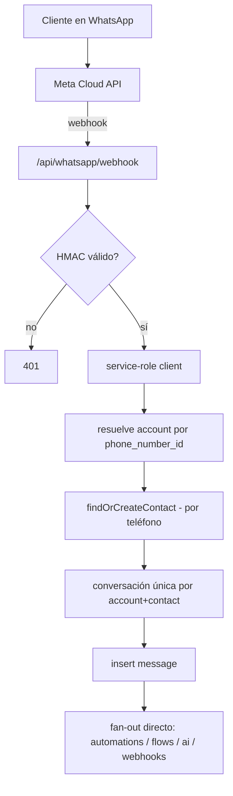
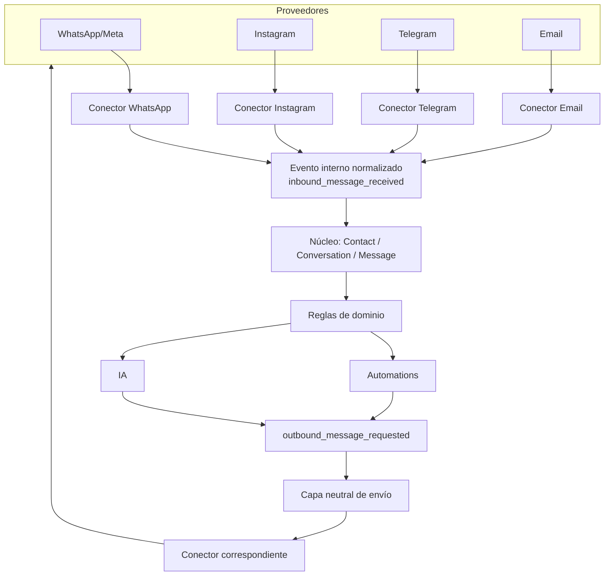
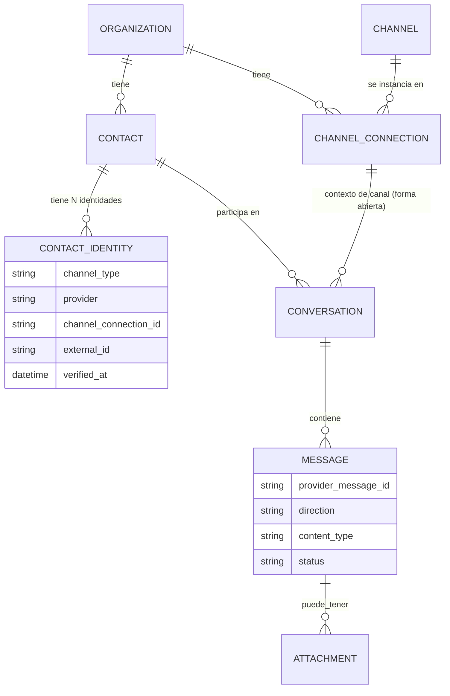
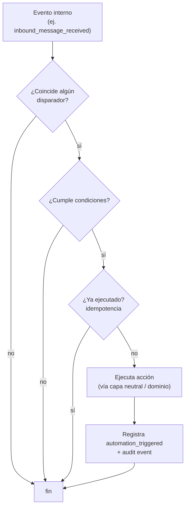

# Arquitectura del Núcleo — Modelo Conceptual

> **Estado:** arquitectura conceptual vigente. El proyecto superó la Etapa 0 (solo-documentación) y las bases de la Fase 1: los flujos esenciales del Inbox están operativos. El sistema entra en **Fase 3 — transformación en un SaaS multiempresa operable por clientes reales.** Ese avance **no** activa por sí mismo la migración omnicanal grande (regla 1.10): la Fase 3 no agrega canales nuevos todavía.
> **Propósito:** este documento sigue siendo la **referencia arquitectónica permanente** (la "constitución técnica"). Define principios y entidades, no el plan operativo de ninguna fase. La ejecución específica de la etapa actual vive en **`phase-3-saas-instructions.md`**; el estado real y verificado del sistema quedará documentado en **`current-state.md`**, que se creará durante la Fase 3.0B.
> **Lo que NO cambia con la Fase 3:** las decisiones abiertas (§5.2), el modelo comercial de mensajes (§5.4) y las preguntas previas a la primera migración (§5.5) **siguen abiertas**. La Fase 3 las hereda; no las resuelve silenciosamente. Cualquier decisión que las cierre deberá hacerse de forma explícita y justificada contra este documento.

---

## Nomenclatura: Organization vs account

- **`Organization`** es el término **conceptual y canónico** del producto futuro. En este documento, "organización" = el tenant, la empresa cliente.
- **`account`** es la **implementación técnica actual** en WACRM (tablas `accounts`, `profiles.account_id`, helper `is_account_member`).
- Durante la **Etapa 0 no se renombra nada.** El código sigue usando `account`.
- Un eventual renombrado técnico `account → organization` queda **abierto** y deberá evaluarse por costo, compatibilidad y beneficio real. No es urgente ni bloqueante.

Cuando este documento dice "pertenece a una organización", en el código de hoy eso se implementa como `account_id`.

---

## 1. Reglas de arquitectura (definitivas)

1. **WhatsApp es un conector, no el núcleo.**
2. **Ningún módulo nuevo de IA, flows o automations puede importar directamente `lib/whatsapp`.**
3. **Todo envío futuro debe pasar por una única capa neutral de mensajería.**
4. **Todo evento externo debe convertirse a un evento interno normalizado** antes de afectar el núcleo.
5. **El contacto interno y sus identidades externas son conceptos separados.**
6. **Toda conversación debe conservar el contexto del canal y de la conexión externa correspondiente.** (La forma exacta de modelarlo queda abierta — ver entidad Conversation.)
7. **No se fusionan contactos por nombre.** Solo por identidad externa verificada o vinculación manual confirmada.
8. **Todo acceso service-role debe validar la pertenencia a la organización** (`account_id`/`organization_id`). El aislamiento no debe depender permanentemente de recordar el filtro a mano en cada ruta.
9. **Toda operación crítica debe ser idempotente y auditable.**
10. **No se hará una migración omnicanal grande durante Fase 1.**

---

## 2. Entidades del núcleo

Para cada entidad: qué representa · organización a la que pertenece · relaciones · identificadores externos · qué nunca debe depender de Meta/WhatsApp · campos WACRM reutilizables · cambios futuros.

### 2.1 Organization
- **Representa:** la empresa cliente (el tenant). Unidad de aislamiento de todo dato.
- **Pertenencia:** es la raíz; no pertenece a otra.
- **Relaciones:** tiene muchos Users (vía Membership), Contacts, Conversations, Channels, Pipelines, etc.
- **Identificadores externos:** ninguno propio (podría guardar IDs de facturación externos en el futuro).
- **Nunca debe depender de Meta/WhatsApp:** la existencia de una organización es independiente de tener o no un canal conectado.
- **Reutilizable de WACRM:** tabla `accounts` (id, name, owner_user_id).
- **Cambios futuros:** posible renombrado a `organization`; posibles campos de plan/límites (entitlements).

### 2.2 User
- **Representa:** una persona con credenciales que puede pertenecer a una o varias organizaciones.
- **Pertenencia:** transversal — un User no "pertenece" a una sola organización; se relaciona vía Membership.
- **Relaciones:** N Memberships; puede ser `assigned_agent` de conversaciones.
- **Identificadores externos:** email de login; futuros IdP/SSO.
- **Nunca debe depender de Meta/WhatsApp:** la identidad del usuario es de la plataforma, no de un canal.
- **Reutilizable de WACRM:** `auth.users` (Supabase Auth) + `profiles`.
- **Cambios futuros:** SSO, 2FA a nivel de organización.

### 2.3 Membership
- **Representa:** la relación entre un User y una Organization, con un rol.
- **Pertenencia:** a una organización (y a un user).
- **Relaciones:** une User ↔ Organization; porta Role.
- **Multi-organización (explícito):** un mismo User puede pertenecer a **múltiples Organizations y tener un Role diferente en cada una**. La membresía es la que porta el rol, no el usuario en abstracto.
- **Identificadores externos:** ninguno.
- **Nunca debe depender de Meta/WhatsApp.**
- **Reutilizable de WACRM:** `profiles.account_id` + `profiles.account_role` + helper `is_account_member(account_id, min_role)`.
- **Nota de implementación actual:** el modelo de hoy asocia un usuario a **una** cuenta vía `profiles.account_id`. Admitir un usuario en varias organizaciones a la vez **podría requerir evolucionar** ese modelo (p. ej. una tabla de membresías N:N). Esa migración **no pertenece a la Etapa 0** y queda como decisión abierta.
- **Cambios futuros:** invitaciones (ya existen RPCs 018/019); membresías N:N usuario↔organización.

### 2.4 Role, Permission y Entitlement
Tres conceptos **distintos** que no deben confundirse:

- **Role** — agrupación de permisos asociada a una **membresía** (owner/admin/agent/viewer). Responde "¿qué nivel tiene esta persona en esta organización?".
- **Permission** — una **acción concreta** que un usuario puede ejecutar (p. ej. "editar pipeline", "enviar broadcast"). Responde "¿puede este usuario hacer esta acción?".
- **Entitlement** — una **función, capacidad o límite** disponible según el **plan** de la organización (p. ej. `max_channels`, `ai_enabled`, `max_messages`). Responde "¿qué le permite el plan a esta organización?".

**No se deben describir permisos granulares como entitlements.** Un permiso es sobre lo que un usuario *puede hacer*; un entitlement es sobre lo que el *plan* de la organización *habilita*. Son ejes independientes: un usuario puede tener el permiso para usar IA, pero la organización no tener el entitlement `ai_enabled`.

- **Pertenencia:** Role y Permission operan dentro de una organización (vía Membership). Entitlement pertenece a la organización (vía su plan).
- **Identificadores externos:** ninguno.
- **Nunca debe depender de Meta/WhatsApp.**
- **Reutilizable de WACRM:** `account_role_enum` (owner/admin/agent/viewer) + policies que distinguen lectura/escritura por rol. Entitlements **no existen hoy** — son un concepto futuro para Fase 3.
- **Cambios futuros:** de roles fijos a permisos más granulares; introducir entitlements por plan cuando se implemente facturación.

### 2.5 Contact
- **Representa:** la persona/cliente **interno** de la organización — independiente del canal.
- **Pertenencia:** a una organización.
- **Relaciones:** tiene N Contact Identities; N Conversations; puede tener Opportunities, Tasks, tags, notas.
- **Identificadores externos:** **ninguno directo** — los identificadores externos viven en Contact Identity (regla 5).
- **Nunca debe depender de Meta/WhatsApp:** un Contact debe poder existir con solo un email, o solo un Telegram, sin teléfono.
- **Reutilizable de WACRM:** `contacts` (id, name, email, company, avatar_url, notas, tags, custom fields).
- **Cambios futuros:** `contacts.phone` deja de ser el eje de identidad (queda abierto si se conserva como legacy/derivado — ver decisiones abiertas).

### 2.6 Contact Identity
- **Representa:** una identidad **externa** del contacto en un canal/proveedor/conexión concretos.
- **Pertenencia:** a una organización; referencia a un Contact.
- **Relaciones:** N por Contact; atada a un `channel_type`, un `provider` y (conceptualmente) a una `channel_connection`.
- **Atributos conceptuales:**
  - `channel_type` — el canal: `whatsapp | instagram | messenger | telegram | email`
  - `provider` — el proveedor de ese canal: p. ej. `meta` para WhatsApp. Separar `provider` de `channel_type` permite soportar distintos proveedores del mismo canal sin cambiar el modelo.
  - `channel_connection_id` — la conexión concreta por la que se conoció esta identidad.
  - `external_id` — el identificador del proveedor: E.164, ig-id, telegram-id, email...
- **Alcance de los IDs externos:** un `external_id` **puede estar limitado** al proveedor, a la aplicación, a la página, al número o a la conexión. Es decir, el mismo string podría no ser globalmente único; su unicidad depende del contexto (provider + conexión). Por eso la restricción no se fija todavía.
- **Nunca debe depender de Meta/WhatsApp:** la tabla es genérica; WhatsApp/meta son solo valores de `channel_type`/`provider`.
- **Reutilizable de WACRM:** el valor de `contacts.phone` actual migraría a una fila `contact_identities(channel_type='whatsapp', provider='meta', external_id=<phone>)`.
- **Modelo conceptual propuesto (no definitivo):**
  ```
  contact_identities
    id, organization_id (account_id), contact_id
    channel_type          -- 'whatsapp' | 'instagram' | 'messenger' | 'telegram' | 'email'
    provider              -- 'meta' | ...  (separado de channel_type)
    channel_connection_id -- la conexión por la que se conoció la identidad
    external_id           -- E.164 | ig-id | telegram-id | email...
    verified_at           -- evidencia de vinculación; nunca por nombre
  ```
- **Restricción UNIQUE — CANDIDATA, no definitiva.** Se propone para discusión, no se fija:
  ```
  UNIQUE(organization_id, channel_connection_id, provider, external_id)
  ```
  Queda abierta hasta revisar cómo cada proveedor delimita sus IDs.
- **Resolución vs. fusión (distinción crítica):**
  - **Resolver** — encontrar una identidad existente permite recuperar el Contact **al que ya está vinculada**. Es una lectura, automática y segura.
  - **Fusionar** — unir **dos Contacts distintos** en uno solo es una operación **explícita, autorizada y auditable**. Nunca ocurre de forma automática, y **nunca por `name`** (regla 7).

### 2.7 Channel
- **Representa:** el **tipo** de canal soportado (WhatsApp, Instagram, Messenger, Telegram, Email...). Catálogo conceptual.
- **Pertenencia:** global al producto (no a una organización), aunque su habilitación puede depender del plan de la organización.
- **Relaciones:** tiene N Channel Connections.
- **Identificadores externos:** ninguno.
- **Nunca debe depender de Meta/WhatsApp:** WhatsApp es una fila del catálogo, no el catálogo.
- **Reutilizable de WACRM:** conceptual; hoy no existe como tabla (el canal está implícito).
- **Implementación ABIERTA.** Channel es un concepto definitivo, pero su forma técnica queda abierta: tabla, enum, registro de conectores en código, u otra representación. **No se decide crear una tabla hasta diseñar el segundo conector.**
- **Cambios futuros:** definir la representación cuando llegue el segundo canal.

### 2.8 Channel Connection
- **Representa:** una conexión concreta de una organización a un canal (una cuenta/número conectado).
- **Pertenencia:** a una organización.
- **Relaciones:** referencia a un Channel; usada por Conversations y Messages para saber por dónde entra/sale el tráfico.
- **Atributos conceptuales:**
  - `channel_type` — el canal (`whatsapp`, `instagram`...).
  - `provider` — el proveedor de ese canal, separado de `channel_type`. Ejemplo: `channel_type = whatsapp`, `provider = meta`. Permite distintos proveedores del mismo canal sin cambiar el modelo.
- **Identificadores externos:** IDs del proveedor (para WhatsApp/meta: `phone_number_id`, `waba_id`).
- **Credenciales vs. metadatos (tratamiento distinto):** los **metadatos comunes** (IDs no secretos, nombre visible, estado) y las **credenciales secretas** (tokens, secrets) deben tener tratamientos **diferentes**. Las credenciales **nunca** deben guardarse como metadatos en claro: van cifradas (como hoy hace `whatsapp_config` con AES-256-GCM), separadas de los metadatos comunes.
- **Nunca debe depender de Meta/WhatsApp en su forma:** debe ser una tabla genérica; los datos específicos del proveedor van en una estructura de metadatos del conector, sin contaminar el núcleo, y los secretos cifrados aparte.
- **Reutilizable de WACRM:** `whatsapp_config` es, conceptualmente, la primera Channel Connection (ya cifra el token). Evolucionaría a `channel_connections` con WhatsApp como un tipo.
- **Cambios futuros:** múltiples conexiones por organización; renovación de credenciales; estado de salud por conexión.

### 2.9 Conversation
- **Representa:** un hilo de intercambio con un contacto.
- **Pertenencia:** a una organización; referencia a un Contact.
- **Relaciones:** N Messages; un `assigned_agent`; **debe conservar contexto de canal y conexión** (regla 6).
- **Identificadores externos:** posibles IDs de hilo del proveedor (email threads, etc.).
- **Nunca debe depender de Meta/WhatsApp:** el estado (open/pending/closed) y la asignación son genéricos.
- **Reutilizable de WACRM:** `conversations` (status, assigned_agent_id, last_message_at, unread_count).
- **Contexto de canal — DECISIÓN ABIERTA.** La regla definitiva es "la conversación conserva el contexto del canal y de la conexión". La **implementación exacta queda abierta** y debe compararse:
  1. `channel_connection_id` directamente en `conversations`.
  2. Una entidad intermedia de hilo (`channel_thread`) entre conversation y connection.
  3. Canal derivado mediante otra relación normalizada.

  Ninguna se fijará sin analizar: hilos externos del proveedor · varias conversaciones simultáneas del mismo contacto en canales distintos · reapertura de conversaciones · email threads (con su propio modelo de hilo) · fusión visual de varios canales en una vista · historial por proveedor.
- **Ciclo de vida — abierto:** unicidad ("una conversación abierta por (org, contact, canal)" vs. hilos fusionables) queda por decidir.

### 2.10 Message
- **Representa:** un mensaje individual dentro de una conversación.
- **Pertenencia:** a una organización (vía conversación).
- **Relaciones:** pertenece a una Conversation; puede tener Attachments; puede referenciar una Channel Connection.
- **Atributo `direction` (conceptual):** `inbound | outbound`. **`direction` y `sender_type` responden preguntas distintas:** `direction` dice si el mensaje **entró o salió** de la plataforma; `sender_type` (customer/agent/bot) dice **quién lo originó**. No son equivalentes — p. ej. un mensaje `outbound` puede tener `sender_type='bot'` (automatización) o `sender_type='agent'` (humano).
- **Identificadores externos:** `provider_message_id` (el wamid de Meta, o el id del proveedor que sea). **No debe asumirse globalmente único** — puede colisionar entre proveedores o conexiones distintas.
- **Clave de idempotencia entrante (conceptual):** para evitar procesar dos veces el mismo mensaje entrante, la clave deberá considerar la tripleta `provider + channel_connection_id + provider_message_id`. **La restricción exacta queda abierta** hasta revisar cómo cada proveedor emite y delimita sus IDs.
- **Nunca debe depender de Meta/WhatsApp:** `sender_type`, `content_type`, `status`, `direction` son genéricos.
- **Reutilizable de WACRM:** `messages` casi entero. `template_name` (ver nota en Documento 1) necesita revisión para decidir si se generaliza o se mueve a metadatos del proveedor.
- **`channel_connection_id` propio vs derivado — DECISIÓN ABIERTA.** Se evaluará si `messages` guarda su propia conexión (trazabilidad, futura fusión de hilos) o la deriva de la conversación.
- **Cambios futuros:** formalizar `provider_message_id` + `direction` + la clave de idempotencia entrante.

### 2.11 Attachment
- **Representa:** un archivo asociado a un mensaje (imagen, documento, audio, video).
- **Pertenencia:** a una organización (vía mensaje/conversación).
- **Relaciones:** pertenece a un Message.
- **Identificadores externos:** id de media del proveedor (temporal); URL en storage propio (persistente).
- **Principio de copia persistente:** cuando el proveedor use **URLs temporales** (como hace Meta con su media), la plataforma **deberá descargar y conservar una copia propia persistente** antes de depender del archivo para cualquier operación futura. No se debe depender de una URL del proveedor que caduca.
- **Controles a definir:** límites de tamaño · validación de MIME · escaneo o validación de archivos · políticas de retención · permisos por organización.
- **Nunca debe depender de Meta/WhatsApp:** el archivo, una vez en storage propio, es agnóstico.
- **Reutilizable de WACRM:** `media_url` en messages + buckets account-scoped (`upload-media.ts`, que ya valida MIME y topes de tamaño). El webhook ya descarga media de Meta hoy — parte del principio ya existe.
- **Cambios futuros:** rescope de buckets viejos; políticas de retención formales.

### 2.12 Internal Event
- **Representa:** un evento normalizado del sistema (ver sección 3). El mecanismo por el que los conectores hablan con el núcleo sin acoplarlo.
- **Pertenencia:** a una organización.
- **Relaciones:** producido por conectores o por el dominio; consumido por automations, analytics, auditoría.
- **Sobre común (conceptual) — todos los eventos comparten esta envoltura:**
  ```
  event_id         -- identificador único de ESTE evento
  event_type       -- p. ej. inbound_message_received
  event_version    -- versión del contrato del evento
  organization_id  -- tenant
  occurred_at      -- cuándo ocurrió en el origen
  received_at      -- cuándo lo recibió la plataforma
  source           -- quién lo emitió (conector X, dominio, IA...)
  actor            -- usuario/sistema responsable, si aplica
  correlation_id   -- agrupa toda una operación de punta a punta
  causation_id     -- identifica el evento que causó este
  idempotency_key  -- clave estable para no procesar dos veces
  payload          -- datos específicos del tipo de evento
  ```
  - **`correlation_id`** agrupa todos los eventos de una misma operación (útil para trazar un flujo completo).
  - **`causation_id`** identifica el evento que produjo el siguiente (cadena causa→efecto).
  - **`event_version`** permite evolucionar el contrato sin romper consumidores existentes.
- **Identificadores externos:** el `payload` porta `provider_message_id` u otros IDs según el evento.
- **Nunca debe depender de Meta/WhatsApp:** es el punto exacto donde lo específico del proveedor se traduce a lo genérico.
- **Reutilizable de WACRM:** conceptual; hoy el "fan-out" del webhook cumple una función parecida pero acoplada y sin sobre formal.
- **Cambios futuros:** formalizar el sobre y el contrato; añadir persistencia/trazabilidad de eventos.

### 2.13 Automation
- **Representa:** una regla disparador → condiciones → acciones, independiente del canal.
- **Pertenencia:** a una organización.
- **Relaciones:** escucha Internal Events; ejecuta acciones (enviar mensaje vía capa neutral, crear tarea, cambiar etapa...).
- **Identificadores externos:** ninguno.
- **Nunca debe depender de Meta/WhatsApp:** los disparadores y acciones deben ser genéricos; el envío pasa por la capa neutral, no por `meta-send`.
- **Reutilizable de WACRM:** `automations` engine (006, 007) — pero su `meta-send.ts` propio debe migrar a la capa neutral (deuda identificada).
- **Cambios futuros:** desacoplar el envío; prevenir bucles/duplicados por diseño.

### 2.14 Task
- **Representa:** una tarea/seguimiento asignable.
- **Pertenencia:** a una organización.
- **Relaciones:** puede ligarse a Contact, Conversation, Opportunity, User responsable.
- **Identificadores externos:** ninguno.
- **Nunca debe depender de Meta/WhatsApp.**
- **Reutilizable de WACRM:** **ninguno — Tasks no existe hoy.** Verificado en el código: no hay tabla `tasks` en las 35 migraciones, ni rutas, componentes o librerías de tasks, ni menciones en el código. Es una entidad enteramente nueva a diseñar. Su forma final es **abierta** (depende del uso real en Fase 1).
- **Cambios futuros:** definir la entidad completa desde cero tras validación de uso; hoy no hay base que reutilizar.

### 2.15 Pipeline
- **Representa:** un proceso de ventas con etapas ordenadas, configurable por organización.
- **Pertenencia:** a una organización.
- **Relaciones:** tiene Stages; contiene Opportunities.
- **Identificadores externos:** ninguno.
- **Nunca debe depender de Meta/WhatsApp:** un pipeline no sabe de canales.
- **Reutilizable de WACRM:** `pipelines` (001, 002) + UI de pipelines existente.
- **Cambios futuros:** forma final **abierta**, dependiente del uso en Fase 1. Un contacto debe poder pertenecer a una oportunidad sin importar por qué canal conversa.

### 2.16 Opportunity
- **Representa:** un negocio/deal potencial ligado a un contacto, moviéndose por un pipeline.
- **Pertenencia:** a una organización.
- **Relaciones:** pertenece a un Pipeline/Stage; ligada a un Contact; puede tener Tasks.
- **Identificadores externos:** ninguno.
- **Nunca debe depender de Meta/WhatsApp.**
- **Reutilizable de WACRM:** deals ligados a conversaciones en el modelo de pipelines actual.
- **Cambios futuros:** forma final **abierta**; valores estimados, moneda (021 ya añadió default currency).

### 2.17 Audit Event
- **Representa:** el registro inmutable de una acción sensible.
- **Pertenencia:** a una organización.
- **Relaciones:** referencia al actor (User o sistema/IA) y al recurso afectado.
- **Modelo conceptual (campos, cuando corresponda):**
  ```
  actor_type      -- user | system | ai
  actor_id        -- quién ejecutó
  action          -- qué acción
  resource_type   -- sobre qué tipo de recurso
  resource_id     -- sobre qué recurso concreto
  reason          -- motivo, si aplica
  origin          -- de dónde vino (UI, API, automation, webhook...)
  ip_address      -- IP de origen, si aplica
  user_agent      -- cliente usado, si aplica
  result          -- éxito | fallo | rechazado...
  correlation_id  -- agrupa la operación completa
  request_id      -- comando/solicitud que originó la acción
  created_at      -- cuándo se registró
  ```
- **Privacidad:** la auditoría **debe evitar almacenar secretos o contenido sensible innecesario**. Registra *qué* pasó y *quién* lo hizo, no vuelca datos privados ni credenciales.
- **Identificadores externos:** ninguno.
- **Nunca debe depender de Meta/WhatsApp.**
- **Reutilizable de WACRM:** conceptual; hoy hay logs dispersos, no un sistema de auditoría unificado.
- **Cambios futuros:** definir el sistema de auditoría (requisito de las reglas 8 y 9).

---

## 3. Contrato conceptual de eventos internos

**Principio clave:** los eventos del **proveedor** (infraestructura/mensajería) **no deben convertirse automáticamente en eventos de negocio**. Un `inbound_message_received` no es un `lead_created`. La conversión ocurre solo tras pasar por reglas, validaciones o automatizaciones del dominio. Se mantienen dos categorías separadas.

### 3.1 Eventos de infraestructura / mensajería

Producidos por los conectores al traducir tráfico del proveedor.

| Evento | Qué lo produce | Datos mínimos | Clave de idempotencia | Consumidores | Auditoría |
|---|---|---|---|---|---|
| `inbound_message_received` | Conector, al recibir webhook entrante | org_id, channel_type, provider, channel_connection_id, external_id, provider_message_id, content{type,text,media}, occurred_at | `provider + channel_connection_id + provider_message_id` (abierta — ver Message) | automations, flows, ai-reply, inbox, analytics | recepción + dedupe por la tripleta |
| `outbound_message_requested` | Dominio/UI/automation, al pedir un envío | org_id, conversation_id, content, request_id, actor | `request_id` (comando original) | capa neutral de envío | quién pidió, cuándo |
| `outbound_message_sent` | Capa neutral, tras aceptar el proveedor | org_id, conversation_id, provider_message_id, request_id | `request_id` | inbox, analytics | confirma envío |
| `message_delivered` | Conector, por webhook de estado | org_id, provider_message_id, status | `event_id` (del evento de estado del proveedor) | inbox, analytics | cambio de estado |
| `message_read` | Conector, por webhook de estado | org_id, provider_message_id, status | `event_id` (del evento de estado del proveedor) | inbox, analytics | cambio de estado |
| `message_failed` | Conector, por webhook de estado | org_id, provider_message_id, error_code | `event_id` (del evento de estado del proveedor) | inbox, automations (reintento), analytics | error + causa |
| `contact_profile_updated` | Conector o dominio | org_id, contact_id, changes | `event_id` | crm, analytics | qué cambió |
| `conversation_opened` | Dominio, al abrir hilo | org_id, conversation_id, channel_connection_id | `event_id` | inbox, analytics | apertura |
| `conversation_closed` | Dominio/agente | org_id, conversation_id, reason | `event_id` | inbox, analytics, automations | cierre + motivo |

### 3.2 Eventos de dominio / negocio

Producidos por el dominio tras aplicar reglas. **Nunca emitidos directamente por un conector.**

| Evento | Qué lo produce | Datos mínimos | Clave de idempotencia | Consumidores | Auditoría |
|---|---|---|---|---|---|
| `lead_created` | Regla de dominio sobre un contacto/conversación | org_id, contact_id, source | `event_id` | crm, analytics | origen del lead |
| `lead_qualified` | Automatización/IA/agente | org_id, contact_id, criteria | `event_id` | crm, analytics | criterio aplicado |
| `pipeline_stage_changed` | Agente/automation | org_id, opportunity_id, from_stage, to_stage | `transition_id` (id estable de la transición) | automations, analytics | transición |
| `opportunity_created` | Dominio | org_id, contact_id, pipeline_id | `opportunity_id` | automations, analytics | creación |
| `task_created` | Dominio/automation/IA | org_id, task_id, assignee | `task_id` | notifications, analytics | asignación |
| `appointment_booked` | Dominio/integración | org_id, contact_id, slot | `appointment_id` | automations, analytics | reserva |
| `payment_confirmed` | Integración de pago/dominio | org_id, contact_id, amount, ref | `payment_ref` (id estable del pago) | automations, analytics, crm | confirmación |
| `automation_triggered` | Motor de automatizaciones | org_id, automation_id, trigger_event_id | `automation_id + trigger_event_id` | analytics, auditoría | disparo |
| `ai_action_requested` | Dominio/agente, al pedir acción de IA | org_id, action_type, context_ref, actor | `request_id` | capa IA | qué se pidió |
| `ai_action_completed` | Capa IA, al terminar | org_id, request_id, result | `request_id` | dominio, analytics | qué decidió/usó/ejecutó |
| `ai_action_failed` | Capa IA, ante error | org_id, request_id, error | `request_id` | dominio, alertas | causa del fallo |

**Idempotencia general:**
- **Entrantes** por la tripleta `provider + channel_connection_id + provider_message_id`; **estados** por el `event_id` del evento del proveedor; **salientes/acciones/comandos** por `request_id`; **transiciones** por su `transition_id`.
- **No se usan timestamps generados durante el procesamiento como mecanismo principal de idempotencia** — se usan identificadores estables del evento o del comando original (`event_id`, `request_id`, `transition_id`, o el id natural del recurso).
- Una clave de idempotencia **evita repetir el mismo comando**, pero **no debe impedir que una acción válida vuelva a ocurrir más adelante** (p. ej. un contacto puede pasar por la misma etapa dos veces en momentos distintos: son dos transiciones con `transition_id` distintos, no un duplicado).

---

## 4. Diagramas

### 4.1 Flujo actual de un mensaje de WhatsApp



### 4.2 Flujo futuro normalizado mediante conectores



### 4.3 Relación Contact ↔ Identity ↔ ChannelConnection ↔ Conversation ↔ Message



### 4.4 Flujo de una automatización desde un evento hasta una acción



---

## 5. Cierre

### 5.1 Decisiones confirmadas (definitivas, reevaluables ante nueva evidencia)

> **Nota:** estas decisiones están confirmadas para la etapa actual. WACRM continúa siendo la base aprobada para la evolución progresiva. Sin embargo, **cualquiera de ellas puede reevaluarse si aparece nueva evidencia técnica o de uso real.** Ninguna se presenta como garantía absoluta.


- WACRM es la base legítima de evolución del producto.
- Estrategia: migración progresiva, no reconstrucción desde cero.
- No habrá migración omnicanal grande durante Fase 1.
- WhatsApp es un conector, no el núcleo.
- Contact e identidad externa son conceptos diferentes.
- Nunca se fusionarán contactos únicamente por nombre.
- Toda conversación debe conservar contexto de canal (implementación exacta abierta).
- Todo evento externo se normaliza antes de afectar el núcleo.
- Ningún módulo nuevo de IA/flows/automations importa `lib/whatsapp` directamente.
- El envío evolucionará hacia una capa neutral.
- Toda operación crítica debe ser idempotente y auditable.
- El aislamiento multiempresa no debe depender permanentemente de filtros manuales dispersos.
- `Organization` es el término conceptual; `account` sigue siendo el término técnico actual.
- Etapa 0 es únicamente documentación y disciplina; sin migraciones ni cambios de producción.

### 5.2 Decisiones abiertas

- Implementación exacta del contexto de canal en `conversations` (columna directa / entidad `channel_thread` / relación normalizada).
- Si `messages` tendrá `channel_connection_id` propio o lo derivará.
- Diseño final de `contact_identities`.
- Tratamiento futuro de `contacts.phone` (legacy/derivado vs eliminación).
- Unicidad y ciclo de vida de las conversaciones.
- Modelo de hilos de email y otros proveedores.
- Implementación concreta del guardián multiempresa.
- Momento del rescope de storage.
- Forma definitiva de Task, Pipeline y Opportunity.
- Modelo comercial de mensajes y consumo (ver 5.4).
- Momento de agregar el segundo canal.
- Renombrado técnico futuro de `account` a `organization`.
- Restricción UNIQUE definitiva de `contact_identities` (candidata propuesta, no fijada).
- Restricción exacta de idempotencia de mensajes entrantes (tripleta provider/conexión/provider_message_id).
- Representación técnica de Channel (tabla / enum / registro de conectores).
- Evolución del modelo de membresía a N:N (usuario en varias organizaciones).

### 5.3 Riesgos

- **Aislamiento por disciplina, no por diseño:** una ruta service-role nueva sin filtro `account_id` reabre el patrón del CVE GHSA-63cv-2c49-m5v3.
- **Deuda de acoplamiento:** `meta-send` propios en ai/flows/automations; crecería si se desarrolla más sin la capa neutral.
- **Storage viejo user-scoped:** inconsistencia de tenencia (severidad baja).
- **Identidad por teléfono:** bloquea canales sin teléfono hasta introducir `contact_identities`.

### 5.4 Modelo comercial de mensajes — abierto (sin conclusiones)

Dos modelos posibles, documentados sin decidir y **sin afirmar requisitos concretos de Meta** (a validar más adelante con documentación oficial):

- **A) El cliente paga su consumo directamente al proveedor.**
- **B) La plataforma cobra, administra o repercute el consumo.**

Dimensiones a analizar antes de decidir: diferencias operativas · riesgos · contabilidad · conciliación · impagos · márgenes · responsabilidad por consumo · complejidad técnica. La categoría/aprobación que cada modelo exija de Meta se verificará con documentación oficial en su momento, no aquí.

### 5.5 Preguntas a resolver antes de la primera migración

1. ¿Cuál de las tres formas de contexto de canal en conversations se adopta, y por qué (con los casos: hilos externos, simultaneidad, reapertura, email, fusión visual, historial por proveedor)?
2. ¿`contacts.phone` se conserva como legacy/derivado o se elimina tras `contact_identities`?
3. ¿Convención de unicidad de conversación: una por (org, contact, canal) o hilos fusionables?
4. ¿El guardián multiempresa será una capa obligatoria única o un mecanismo de verificación por ruta?
5. ¿`messages.channel_connection_id` propio o derivado?
6. ¿Cuándo se agenda el rescope de storage?
7. ¿Qué modelo comercial (A/B) y qué implica realmente en Meta según su documentación vigente?

### 5.6 Propuesta de Etapa 0 (sin cambios destructivos)

Limitada estrictamente a:

- **Documentación** (estos dos archivos).
- **Regla de no crear nuevo acoplamiento con WhatsApp:** ningún módulo nuevo importa `lib/whatsapp` fuera del conector.
- **Identificación de puntos de envío directo a Meta:** `ai/*`, `flows/meta-send.ts`, `flows/trigger-meta.ts`, `automations/meta-send.ts` (inventario, no modificación).
- **Propuesta de una futura interfaz neutral de envío** (concepto, no código).
- **Pruebas de aislamiento multiempresa:** documentar las existentes (fix del CVE en automations/engine) y las faltantes (guardián central, storage viejo).
- **Ninguna migración de base de datos.**
- **Ningún cambio de comportamiento en producción.**
