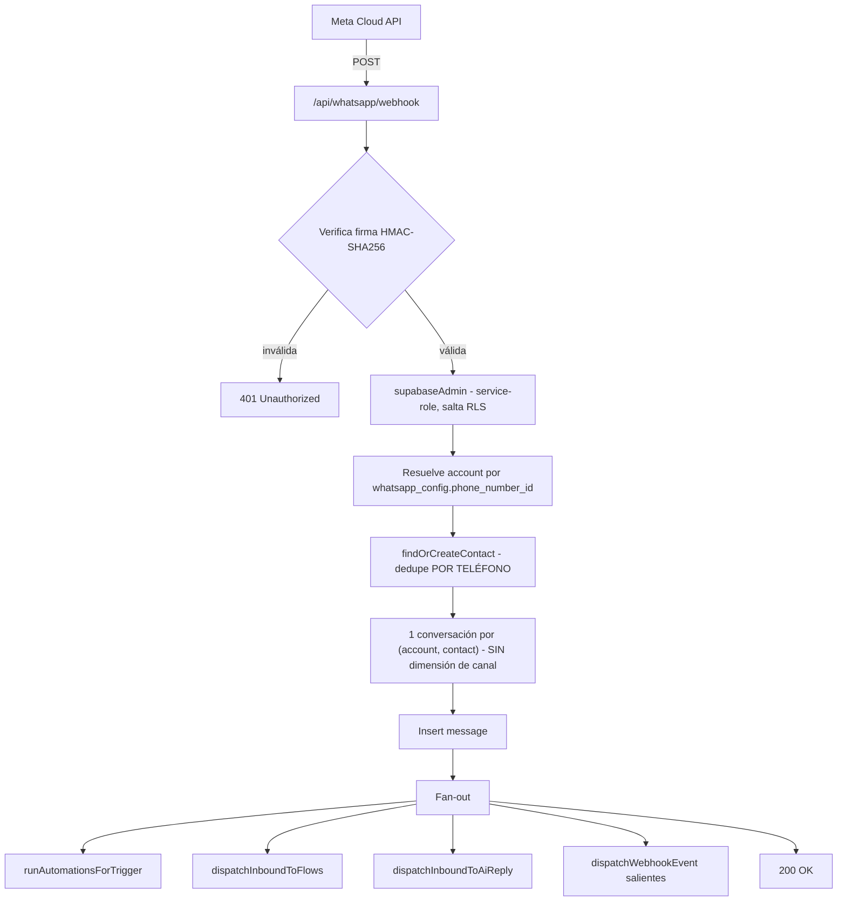

# Auditoría del Estado Actual — WACRM

> **Estado:** Etapa 0 — solo documentación.
> **Alcance:** este documento describe el sistema tal como está hoy. No propone ni ejecuta cambios de código, base de datos o configuración.
> **Método:** lectura directa del código del fork (`github.com/jackwvr1-ai/wacrm`): 341 archivos TS/TSX y 35 migraciones SQL. Las afirmaciones se apoyan en el código real, no en nombres de tablas o rutas.

---

## Propósito

Establecer una base de evidencia compartida sobre cómo funciona WACRM hoy, para poder decidir su evolución hacia una plataforma omnicanal sin suposiciones. Este documento es el punto de partida factual; el diseño futuro vive en `core-architecture.md`.

---

## 1. Flujo actual de mensajes

### 1.1 Entrante (WhatsApp → CRM)



Puntos verificados en el código:
- La firma se valida en `lib/whatsapp/webhook-signature.ts`, fail-closed.
- La tenencia se resuelve desde la fila `whatsapp_config` que coincide con el `phone_number_id` (webhook línea ~256).
- El contacto se resuelve/crea con `findOrCreateContact`, que internamente usa `findExistingContact` de `lib/contacts/dedupe.ts`.
- La convención "una conversación por (account, contact)" está afirmada en `resolve-conversation.ts` (líneas 12 y 140) y replicada en el webhook.

**Etiquetas del diagrama — literales vs conceptuales:**
- **Nombres literales del código** (verificados): `/api/whatsapp/webhook`, `runAutomationsForTrigger`, `dispatchInboundToFlows`, `dispatchInboundToAiReply`, `dispatchWebhookEvent`, `findOrCreateContact`, `whatsapp_config`, `phone_number_id`.
- **Descripciones conceptuales** (no son nombres literales del repo): "Resuelve account por...", "dedupe POR TELÉFONO", "1 conversación por (account, contact) - SIN dimensión de canal", "Fan-out", "service-role, salta RLS". Describen comportamiento, no identificadores del código.

### 1.2 Saliente (CRM → WhatsApp)

```
Composer del dashboard  → POST /api/whatsapp/send  → lib/whatsapp/send-message.ts → meta-api.ts → Meta
API pública             → POST /api/v1/messages    → resolve-conversation.ts       → send-message core → Meta
Módulos alto-nivel      → ai/flows/automations tienen su PROPIO meta-send.ts       → Meta
```

El envío desde el composer y desde la API pública converge en un core compartido (`sendMessageToConversation`). **Pero** los módulos de IA, flows y automations no pasan por ese core: cada uno tiene su propio punto de contacto con Meta (ver sección 7).

---

## 2. Mapa de dependencias

```
NÚCLEO (genérico)                 CONECTOR (WhatsApp)           MÓDULOS ALTO-NIVEL
contacts                          lib/whatsapp/ (32 archivos)   inbox
conversations        ←────────────  meta-api.ts                 pipelines
messages                          send-message.ts              automations ─┐
tags / custom_fields              template-*.ts                flows ───────┤ cada uno
                                  webhook-signature.ts         ai ──────────┘ con meta-send propio
                                  resolve-conversation.ts      api/v1 (genérica)
```

- **42 archivos** importan de `lib/whatsapp/`.
- La capa `src/app/api/v1/` (contacts, conversations, messages, webhooks) está construida sobre el core compartido y es la más cercana a "genérica".
- **Gran parte de `src/lib`** está separada del transporte (account, contacts, inbox, api, storage, auth, dashboard), **aunque existen acoplamientos directos con Meta en `ai`, `flows` y `automations`** (cada uno con su propio `meta-send`, ver sección 7).

---

## 3. Partes genéricas (reutilizables tal cual)

Verificado por inspección de columnas y código:

- **`contacts`**: `id, user_id, phone, name, email, company, avatar_url, created_at, updated_at`. Ya incluye `email` y `company`. Ninguna columna WhatsApp-específica.
- **`conversations`**: `id, contact_id, status(open/pending/closed), assigned_agent_id, last_message_text, last_message_at, unread_count`. Cero referencias a WhatsApp.
- **`messages`**: `sender_type(customer/agent/bot), content_type(text/image/document/audio/video/location/template), content_text, media_url, status(sending/sent/delivered/read/failed)`. Agnóstico de canal salvo `template_name`.
- El modelo multi-tenant (`accounts`, roles, `is_account_member()`) de la migración 017.
- Módulos de dominio: automations engine, pipelines, inbox, dashboard queries, API v1.

**Observación:** el núcleo de datos aparece mayoritariamente genérico y el transporte está aislado en `lib/whatsapp/`, con las excepciones de acoplamiento señaladas en las secciones 4 y 7.

---

## 4. Supuestos WhatsApp-only encontrados

A pesar de que los nombres no dicen "whatsapp", el **comportamiento** contiene estos supuestos:

1. **Identidad = teléfono.** `dedupe.ts` define la clave canónica como `normalizePhone` (solo dígitos). Existe `contacts.phone_normalized` (columna generada) con unique por account. Los tres caminos de creación (webhook, formulario manual, import CSV) deduplican por teléfono. **Un contacto sin teléfono no existe hoy** — incompatible con Instagram/email.
2. **Conversación sin canal.** La convención "una conversación por (account, contact)" no contempla que el mismo contacto tenga hilos simultáneos en canales distintos.
3. **`messages.template_name`** está implementado hoy según el modelo de plantillas de Meta. **No es necesariamente exclusivo de Meta** — otros canales admiten plantillas, respuestas estructuradas o mensajes preaprobados. Necesita revisión para determinar si se generaliza o se mueve a metadatos específicos del proveedor.
4. **`meta-send` propio en módulos alto-nivel** (ver sección 7).

Estos cuatro puntos son el trabajo real de desacople futuro; el resto del núcleo ya sirve.

---

## 5. Riesgos multiempresa y uso de service-role

### 5.1 Inventario

**Método de conteo:** `grep -rln "SERVICE_ROLE_KEY\|supabaseAdmin" src/app/api --include="*.ts" | wc -l` → **14 rutas API**. Adicionalmente, librerías bajo `src/lib` también usan service-role.

**Rutas API con service-role (verificadas):**
`ai/draft` · `quick-replies` · `quick-replies/[id]` · `flows` · `flows/cron` · `flows/[id]` · `flows/[id]/activate` · `whatsapp/webhook` · `whatsapp/config` · `automations` · `automations/cron` · `automations/[id]` · `automations/[id]/duplicate` · (más `whatsapp/send` en su archivo de test).

**Librerías con service-role:** `ai/auto-reply`, `ai/admin-client`, `flows/engine`, `flows/meta-send`, `flows/admin-client`, `automations/engine`, `automations/meta-send`, `automations/admin-client`, `api-keys/store`, `auth/api-context`, `whatsapp/send-message`.

### 5.2 Lo verificado como correcto

- **El fix del CVE GHSA-63cv-2c49-m5v3 está presente y es correcto.** En `automations/engine.ts` (líneas 75-87): cuando `contactId` viene del caller, verifica `.eq('account_id', input.accountId)` y rehúsa el despacho si no pertenece, con un comentario que explica que un error distinto filtraría la existencia del UUID.
- **La API pública** (`auth/api-context.ts`) obliga a `ctx.accountId` derivado del API key y documenta "scope every query by it". Valida scopes antes de rate-limit.

### 5.3 Precisión sobre las capas de validación

**`user_id` NO es equivalente a `account_id`.** Filtrar por `user_id` **no garantiza** aislamiento correcto entre organizaciones, especialmente si un usuario pertenece (o llega a pertenecer) a varias cuentas. Un aislamiento correcto requiere distinguir **cuatro validaciones separadas**, que no deben confundirse:

1. **Identidad** — ¿quién es el usuario? (`auth.getUser()`).
2. **Membresía** — ¿este usuario pertenece a esta organización? (`is_account_member`).
3. **Organización activa** — ¿en el contexto de qué organización opera ahora? (relevante si el usuario tiene varias).
4. **Propiedad del recurso** — ¿el recurso solicitado pertenece a esa organización? (`.eq('account_id', ...)`).

Varias rutas del dashboard hoy autentican identidad (`getUser()`) y filtran por `user_id`; esto **no es lo mismo** que validar membresía + organización activa + propiedad por `account_id`. Verificar ruta por ruta cuál de las cuatro capas aplica cada una es trabajo pendiente (no de Etapa 0).

### 5.4 El riesgo real

El aislamiento **no es sólido por diseño; es sólido por disciplina repetida.** El filtro `account_id` se aplica a mano en cada ruta service-role. Basta que **una** ruta nueva olvide ese filtro — o confunda `user_id` con `account_id` — para reabrir exactamente el tipo de agujero del CVE. No existe un guardián central que lo garantice estructuralmente.

---

## 6. Riesgos de storage

- **Buckets nuevos: account-scoped.** `lib/storage/upload-media.ts` construye rutas `<bucket>/account-<account_id>/...` y la RLS del bucket aísla por ese primer segmento.
- **Buckets viejos: user-scoped.** La propia migración 017 lo admite: *"Storage buckets (avatars, flow-media) stay user-scoped. A later migration will rescope flow-media to account paths."*
- **Riesgo:** en un escenario multi-agente, avatars/flow-media podrían no estar aislados por account. **Severidad pendiente de evaluar** según el contenido real de los buckets, la accesibilidad de los mismos y las policies aplicadas. Flow-media puede contener información interna o archivos subidos por clientes, por lo que no se clasifica como "bajo" de antemano. Es una inconsistencia real de tenencia que debe evaluarse y cerrarse antes de escalar equipos.

---

## 7. Módulos de IA, flows y automations que llaman a Meta directo

Hallazgo confirmado: cada uno de estos módulos tiene su propio punto de contacto con Meta:

- `src/lib/ai/` → llama al envío por su cuenta
- `src/lib/flows/meta-send.ts` y `flows/trigger-meta.ts`
- `src/lib/automations/meta-send.ts`

**Implicación:** los módulos de dominio (alto nivel) conocen a Meta directamente, en lugar de emitir una intención de envío neutral. Cada nueva funcionalidad de IA/flows/automations que repita este patrón multiplica los puntos a desacoplar después. **Este es el vector de deuda técnica a congelar de inmediato** (regla de disciplina, sin tocar código existente).

---

## 8. Opciones evaluadas

| Opción | Costo | Riesgo | Deuda | Veredicto (con la evidencia actual) |
|---|---|---|---|---|
| **1. Extender el fork tal cual** (multi-canal encima de lo actual) | Medio | Medio-alto | Alta | **No recomendada** con la evidencia actual — sin abstracción de canal, cada conector toca decenas de archivos |
| **2. Migración progresiva a núcleo genérico** | Medio | Bajo-medio | Baja | **Recomendación provisional** — el núcleo ya está casi genérico; se evoluciona, no se reconstruye |
| **3. Núcleo nuevo desde cero** | Muy alto | Alto | Baja (pagada por adelantado) | **No justificada** con la evidencia actual — no se observa un núcleo podrido que la exija |

**Las tres opciones podrían reevaluarse** si cambia la arquitectura, aparecen bloqueos técnicos graves, o se descubre nueva evidencia (de código o de uso real). Ninguna queda descartada de forma irreversible.

---

## 9. Decisión provisional

**WACRM es la base legítima de evolución del producto.** La estrategia es **migración progresiva (Opción 2)**, no reconstrucción. **No se ejecutará una migración omnicanal grande durante Fase 1.**

**Conclusión provisional (no garantía):** la evidencia actual indica que el núcleo **probablemente puede evolucionar progresivamente**, sujeto a validar permisos, comportamiento real y compatibilidad de migraciones. Esta conclusión se apoya en las secciones 3 y 4, y se reevaluará si aparece nueva evidencia técnica o de uso.

---

## 10. Qué hacemos ahora vs qué posponemos

| Ahora (Etapa 0 — barato, no destructivo) | Posponer (requiere validación / diseño) |
|---|---|
| Documentar arquitectura actual y núcleo futuro | Crear `channels` / `channel_connections` |
| Regla: nada nuevo importa `lib/whatsapp/` fuera del conector | Diseño e implementación de `contact_identities` |
| Fijar el contrato de eventos internos como norte | Añadir contexto de canal a conversations |
| Revisar explícitamente cada nueva ruta service-role | Centralizar el guardián multiempresa |
| Usar WACRM con WhatsApp, aprender el dominio | Rescope de storage viejo a account |
| Identificar puntos de envío directo a Meta | Capa neutral de envío |

**Ninguna acción de la columna izquierda modifica base de datos ni comportamiento de producción.**
